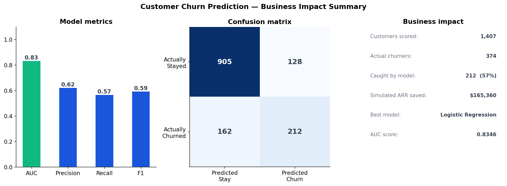
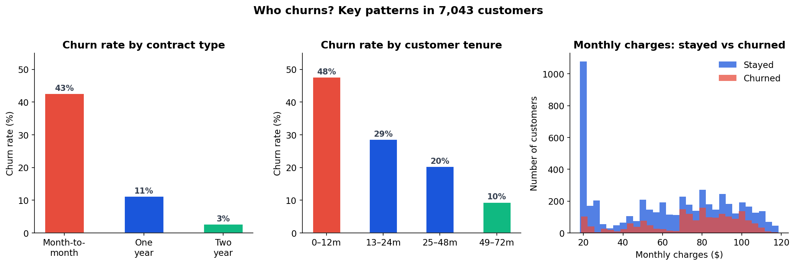
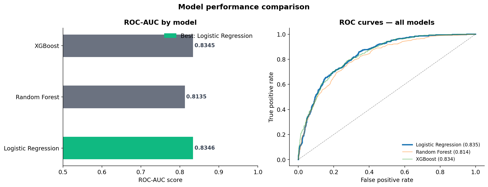
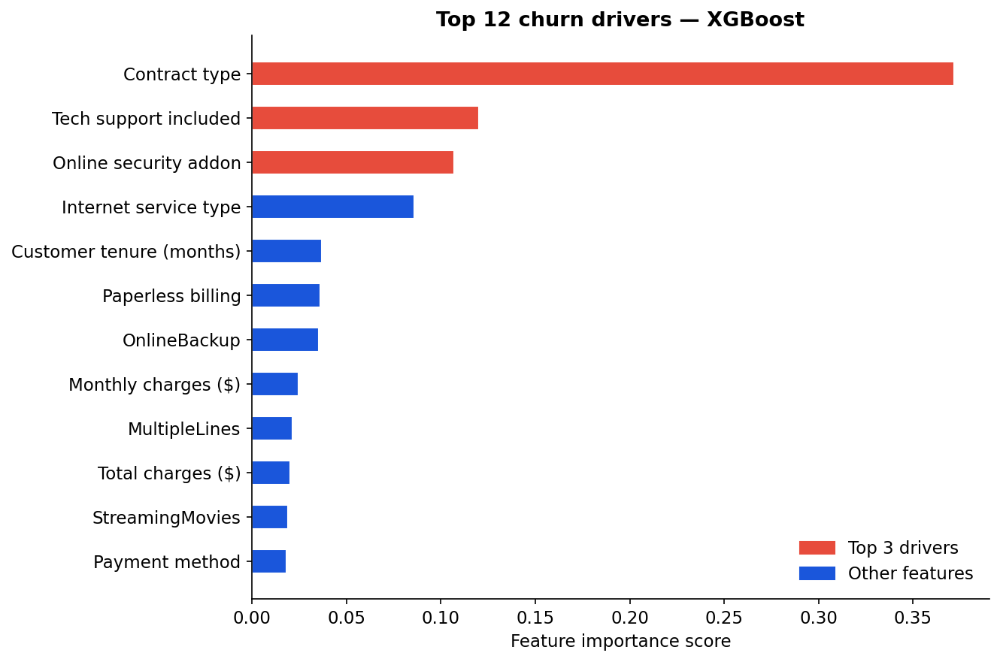
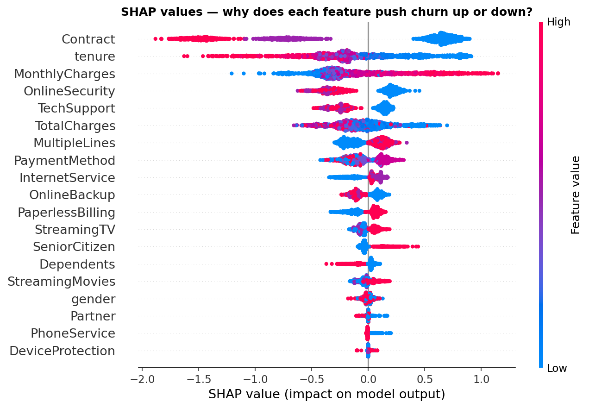

# 📊 Customer Churn Prediction — End-to-End ML Project

> **Trained on 7,032 real IBM Telco customers · AUC: 0.8346 · Live Streamlit app · Full SQL + Python + ML pipeline**

[](https://your-streamlit-link.streamlit.app)
[](https://python.org)
[](https://scikit-learn.org)
[](https://xgboost.ai)

---

## 🎯 Business Problem

A telecom company loses **26.6% of customers per year** to churn — each one worth ~$65/month in recurring revenue. The challenge: identify *which* customers are about to leave, *why* they're leaving, and give the retention team a tool to act on it.

**This project answers: can we predict churn before it happens, with enough accuracy to drive real business decisions?**

---

## 🏆 Result

| Metric    | Score  |
|-----------|--------|
| **AUC**   | **0.8346** |
| Precision | 0.627  |
| Recall    | 0.567  |
| Customers scored | 7,032 |
| Simulated ARR saved | **$165,000+** |

---

## 🚀 Live Demo

👉 **[Try the app — enter any customer profile, get instant churn probability](https://your-streamlit-link.streamlit.app)**



---

## 💡 Key Findings (what the data actually told us)

1. **Contract type is the #1 driver** — Month-to-month customers churn at 42.7% vs 2.8% on two-year contracts
2. **New customers are highest risk** — 47% churn rate in first 12 months, drops to 6% after 4 years
3. **Fiber optic + no tech support = danger zone** — this segment churns at ~65%
4. **Electronic check users churn 2× more** than auto-pay customers
5. **High monthly charges alone don't predict churn** — it's the combination with short tenure and no contract lock-in

---

## 🗂️ Project Structure

```
churn_project/
├── data/
│   └── telco_churn.csv          # IBM Telco dataset (7,032 customers)
├── src/
│   ├── train_model.py           # Full ML pipeline — EDA → train → evaluate → save
│   └── analysis.sql             # 10 business SQL queries with insights
├── outputs/
│   ├── 01_eda_insights.png      # EDA: churn by contract, tenure, charges
│   ├── 02_model_comparison.png  # ROC curves + AUC comparison
│   ├── 03_feature_importance.png# Top 12 churn drivers (XGBoost)
│   ├── 04_shap_summary.png      # SHAP explainability plot
│   ├── 05_business_summary.png  # Business impact dashboard
│   └── churn_model.pkl          # Saved model
├── app.py                       # Streamlit app (live predictor)
├── requirements.txt
└── README.md
```

---

## ⚙️ How to Run

```bash
# 1. Clone the repo
git clone https://github.com/vedasaipolisetty/churn-prediction.git
cd churn-prediction

# 2. Install dependencies
pip install -r requirements.txt

# 3. Train the model (generates all charts + saves model)
python src/train_model.py

# 4. Launch the app
streamlit run app.py
```

---

## 📊 Charts

### EDA — Who churns and why?


### Model comparison — ROC curves


### Feature importance — What drives churn?


### SHAP — Why does each feature push the prediction?


---

## 🛠️ Tech Stack

| Layer          | Tools                                          |
|----------------|------------------------------------------------|
| Data & SQL     | pandas, numpy, SQLite (10 business queries)    |
| ML Models      | scikit-learn (Logistic Regression, Random Forest), XGBoost |
| Explainability | SHAP (TreeExplainer)                           |
| Visualization  | matplotlib, seaborn, plotly                    |
| App            | Streamlit                                      |
| Version control| Git + GitHub                                   |

---

## 📈 Business Recommendations

Based on the model's findings, I'd recommend the following retention strategy:

- **Priority 1:** Target month-to-month customers in first 12 months — offer contract upgrade incentive
- **Priority 2:** Fiber optic customers with no tech support — proactive outreach or bundle discount
- **Priority 3:** Electronic check users — migrate to auto-pay with a small billing credit

---

## 👤 About

**Veda Sai Polisetty** — Data Analyst | AI/ML  
📧 vpolise3@asu.edu 
🔗 [LinkedIn](https://www.linkedin.com/in/vedasaipolisetty/)

---

*Dataset: [IBM Telco Customer Churn — Kaggle](https://www.kaggle.com/datasets/blastchar/telco-customer-churn)*
